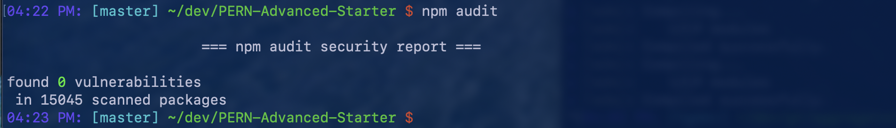
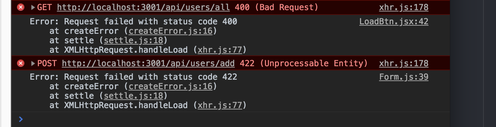

# PERN-Advanced-Starter
The PERN stack: [PostgresSQL](https://www.postgresql.org/), [Express](https://expressjs.com/), [React](https://reactjs.org/), &amp; [Node](https://nodejs.org/en/)

###### Live example: [PERN-Starter](https://pern-starter.herokuapp.com/)

What makes this an advanced starter app you ask? This project folds together several tools that come together for a powerful dev environment and good start for a fully functional production application. It employs an 'advanced' implementation of [pg-promise](http://vitaly-t.github.io/pg-promise/) for interaction with a SQL database with additional basic security concerns added to the [Express](https://expressjs.com/) server.

Here's a list of the other fun bits folded into this project:
- [ESLint](https://eslint.org/): Style guide, syntax, and developer error finder and enforcer
- [Webpack 4](https://webpack.js.org/): Static module bundler, complier, & hot-reloader
- [Redux](https://redux.js.org/): Predictable state container/manager for JavaScript apps
- [React-Router](https://github.com/ReactTraining/react-router#readme): “Dynamic Routing” (navigation) for React client
- [React Material UI](https://material-ui.com/): Component library implementing Google's [Material Design](https://material.io/)
- [Material-UI Kit](https://www.creative-tim.com/product/material-kit-react): Curated mid-level component library complete with view examples
- [Axios](https://github.com/axios/axios): Promise based HTTP client for the browser and node.js

## Using this project

First, make sure you have have PostgreSQL installed and running. Visit [the PostgreSQL home page](https://www.postgresql.org/) for more info and to download the install file.

Open a terminal window and create a new PG database:

	$ createdb PERN-Starter

Then to get going using this starter app, first fork the repo:

Then clone the fork to your local machine:

  $ git clone https://github.com/*YOUR-USERNAME-HERE*/PERN-Advanced-Starter.git

> Why fork? This way you can make your own changes, save them to github, and even share them with the main fork :)

Hop into the project directory and install the dependencies:

	$ cd PERN-Advanced-Starter
	$ npm i

> 
> If you have npm v6+ installed you'll notice 0 vulnerabilities are found. I'm very proud of that, it wasn't easy! More about npm's new(-ish) audit functionality [here](https://docs.npmjs.com/getting-started/running-a-security-audit).

To start the Webpack dev server run:

	$ npm run dev

And to build for deployment/production run:

	$ npm run build
	$ npm start

Also don't forget that your API won't work unless you create a users table.

> Does this look familiar?
> 

To do this hit the following route, either in your browser or with [Postman](https://www.getpostman.com/).

http://localhost:3000/api/users/create  

> Successful return:
> 

If you want to seed use:

http://localhost:3000/api/users/init

>  Successful return:
>

And if you don't have it: [json formatter for chrome.](https://github.com/callumlocke/json-formatter)

## What's happening under the hood

#### pg-promise: [Read up on it.](https://github.com/vitaly-t/pg-promise)

#### Config files you might not recognize:
_.babelrc_ - [Babel](https://babeljs.io/) is a toolchain used by Webpack to convert ECMAScript 2015+ code into a backwards compatible version of JavaScript for old browsers or environments. This file tells Babel our presets and plugins.

_.eslintrc.json_ - This config file tells [ESLint](https://eslint.org/) our settings for interpreting and reporting errors and warnings while we're writing our code. Delete or add rules, change style guide, whatever you want, this is where you do it. For this to work you'll need to make sure you have a linter and eslint installed in your code editor.  

_nodemon.json_ - When Webpack spins up a dev server it also starts [nodemon](https://nodemon.io/) in the background to proxy for api calls. This file tells nodemon which directory to watch for changes and restart when files are updated.

_.webpack.config.js_ - Oh the magic, and let's be honest *heart-burn*, of Webpack! This file gives Webpack all the important details for doing what it does. Again this file is configurable; for more information visit [the configuration docs](https://webpack.js.org/configuration/).

## How did we get here?

There are so many resources out there to help developers resolve issues and build new skills and tools. I'm very thankful for the sharing of knowledge and I wanted to put this project together to help other devs that are hoping to try their hand at a full-stack React application.

This starter app was inspired and guided by the following resources:

- [Simple React Full Stack](https://github.com/crsandeep/simple-react-full-stack)
- [Webpack 4 Quickstart](https://github.com/valentinogagliardi/webpack-4-quickstart)
- [Postgres Advanced Demo](https://github.com/vitaly-t/pg-promise-demo)
- [React & Redux Tutorial](https://www.valentinog.com/blog/react-redux-tutorial-beginners/)
- [React - Material UI Kit](https://www.creative-tim.com/product/material-kit-react)
